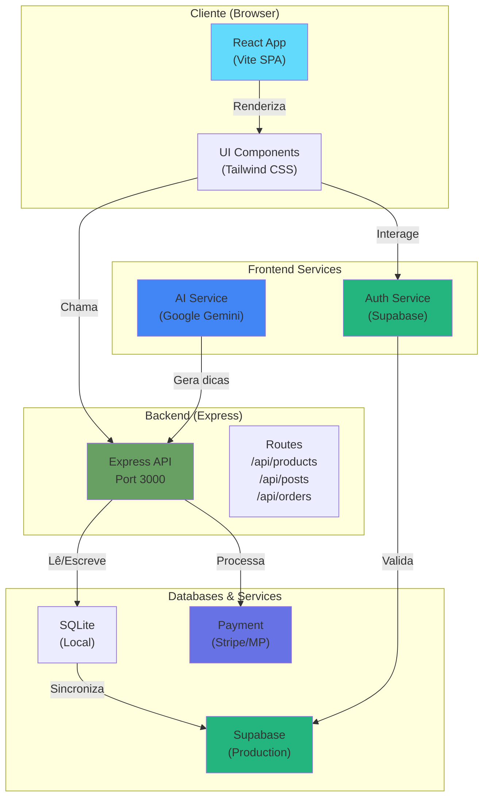
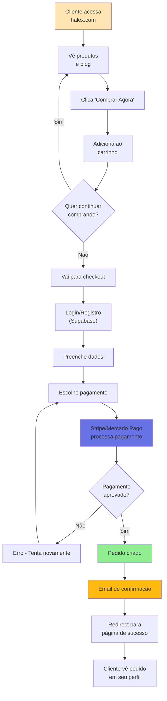
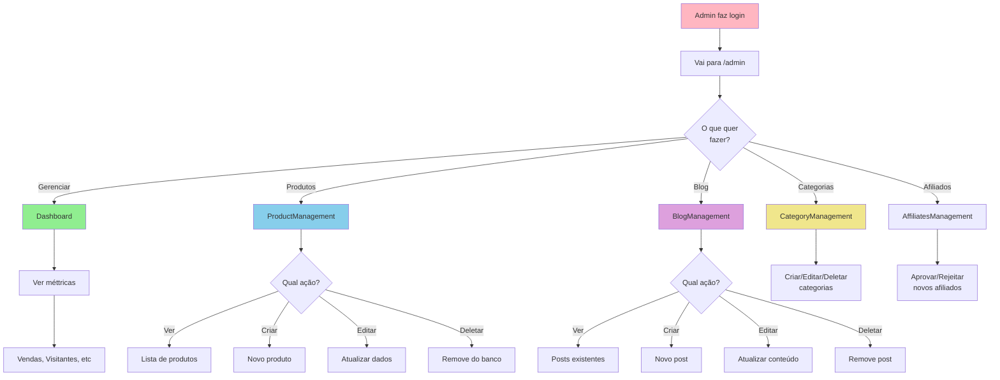
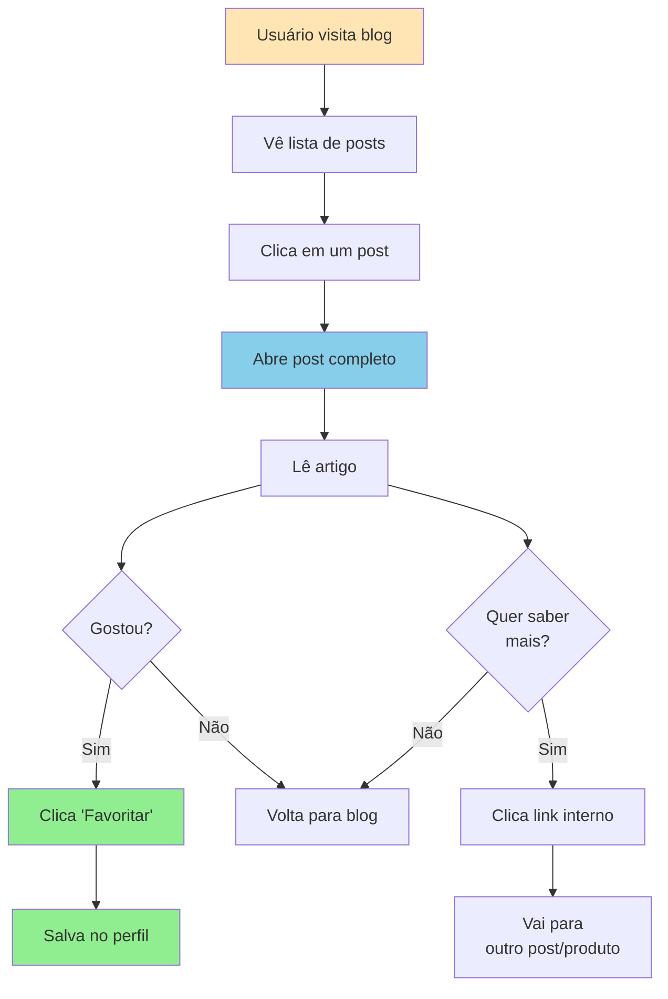
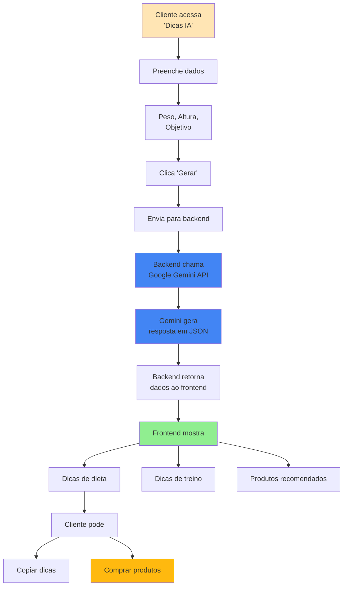
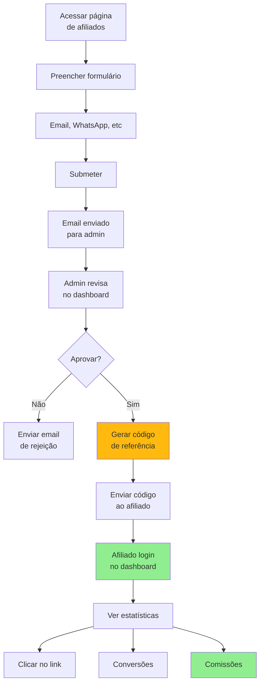
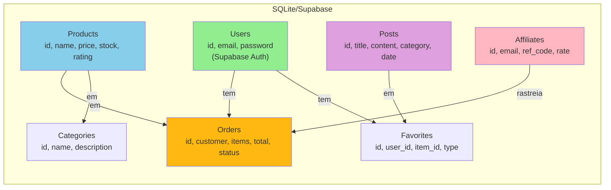
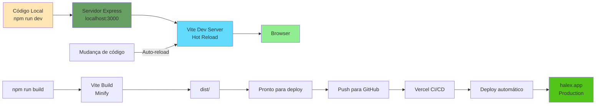
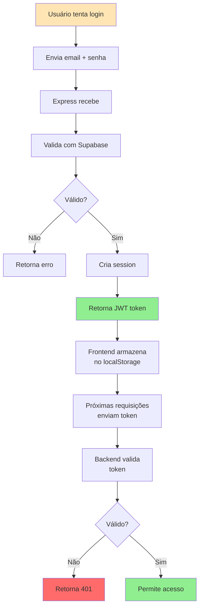

# 🗺️ Arquitetura & Fluxo da Aplicação

## Diagrama da Arquitetura



---

## Fluxo de Compra



---

## Fluxo de Admin



---

## Fluxo de Blog Post



---

## Fluxo de Gerador de Dicas (IA)



---

## Fluxo de Afiliado



---

## Estrutura de Dados

### Tabelas do Banco de Dados



---

## Integração de Serviços Externos

```mermaid
graph TB
    App["Halex App<br/>localhost:3000"]
    
    subgraph "Autenticação"
        Supabase["Supabase Auth<br/>Login/Registro"]
    end
    
    subgraph "Banco de Dados"
        DB["Supabase Database<br/>PostgreSQL"]
    end
    
    subgraph "IA & Machine Learning"
        Gemini["Google Gemini API<br/>Gera dicas"]
    end
    
    subgraph "Pagamentos"
        Stripe["Stripe<br/>Cartão de crédito"]
        MercadoPago["Mercado Pago<br/>PIX, Boleto"]
    end
    
    subgraph "Email"
        Resend["Resend<br/>Transacional"]
        Gmail["Gmail SMTP<br/>Backup"]
    end
    
    subgraph "Deployment"
        Vercel["Vercel<br/>Host Frontend + API"]
    end

    App -->|Login| Supabase
    App -->|Dados| DB
    App -->|Gera dicas| Gemini
    App -->|Processa pag| Stripe
    App -->|Processa pag| MercadoPago
    App -->|Envia email| Resend
    App -->|Backup email| Gmail
    App -->|Deploy| Vercel

    style App fill:#61dafb
    style Supabase fill:#24b47e
    style Gemini fill:#4285f4
    style Stripe fill:#6772e5
    style Vercel fill:#000
    style Resend fill:#000
```



---

## Fluxo de Desenvolvimento



---

## Segurança de Autenticação



---

## Componentes React - Árvore

```
App (componente principal)
├── Navbar
│   ├── Search
│   └── AuthModal
├── Router (páginas)
│   ├── HomePage
│   │   ├── Hero
│   │   ├── FeaturedProducts
│   │   └── BlogPreview
│   ├── StorePage
│   │   └── ProductCard (map)
│   ├── BlogPage
│   │   └── BlogPostCard (map)
│   ├── BlogPostDetailsPage
│   ├── AdminDashboard
│   │   ├── ProductManagement
│   │   ├── BlogManagement
│   │   ├── CategoryManagement
│   │   └── AffiliatesManagement
│   ├── AffiliateLanding
│   └── TipsPage
├── Cart
│   └── CartItem (map)
├── Footer
└── SupportChat
```

---

**Última atualização**: 10/03/2026
